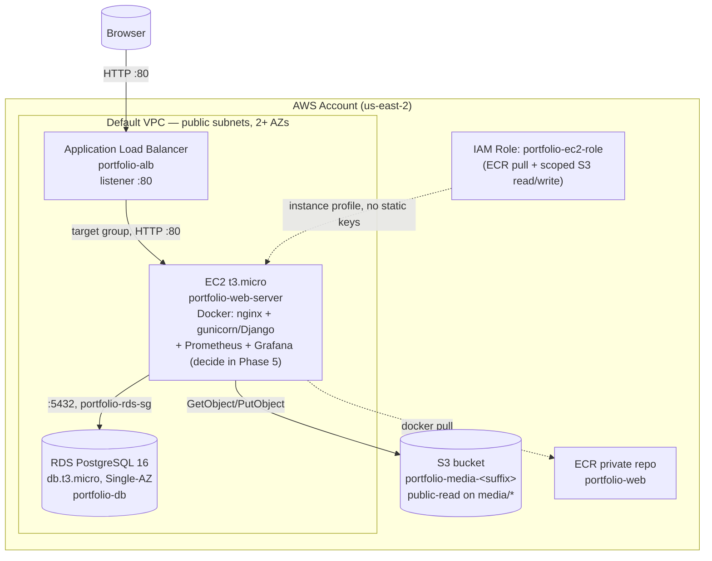

# Cloud Architecture — Portfolio Site on AWS

Status: **design finalized, build in progress.** This is a practice deployment (see "Practice-project caveats" below) — it is expected to be torn down and rebuilt multiple times, not run continuously. For a step-by-step log of what has actually been built so far, see [`cloud_implementation_steps.md`](cloud_implementation_steps.md).

## Diagram

## Resource naming convention

| Resource | Name | Notes |
|---|---|---|
| Security group (ALB) | `portfolio-alb-sg` | Inbound 80 (443 later) from `0.0.0.0/0`. |
| Security group (EC2) | `portfolio-ec2-sg` | Inbound 80 from `portfolio-alb-sg` only; inbound 22 from admin's IP only. |
| Security group (RDS) | `portfolio-rds-sg` | Inbound 5432 from `portfolio-ec2-sg` only. |
| S3 bucket | `portfolio-media-<random-suffix>` | Bucket names are globally unique; suffix decided at creation time. |
| ECR repository | `portfolio-web` | Private repo, one image. |
| RDS instance | `portfolio-db` | Postgres 16, db.t3.micro, Single-AZ. |
| EC2 instance | `portfolio-web-server` | t3.micro. |
| IAM role (EC2 instance profile) | `portfolio-ec2-role` | ECR read + S3 read/write scoped to the one bucket — no long-lived access keys on the box. |
| ALB | `portfolio-alb` | HTTP-only listener until a custom domain + ACM cert exist. |
| Target group | `portfolio-tg` | Port 80, health check against `/`. |

## Key decisions and rationale

| Decision | Choice | Why |
|---|---|---|
| Provisioning | AWS Console for the manual build, Terraform afterward | See every resource get created first; automate the rebuild once the design is proven (Phase 10). |
| Compute | Single EC2 instance behind an ALB, **no Auto Scaling Group** | Deploys are manual (Phase 8) — an ASG would launch bare instances with no app on them. ASG is a documented future step once CI/CD (Phase 9) exists. |
| Database | Amazon RDS (Postgres 16, Single-AZ) instead of a `db` container | Decouples app/data, gets managed backups/patching — matches the current `postgres:16-alpine` version. Single-AZ (not Multi-AZ) because 99.95% uptime is overkill for a portfolio site and Multi-AZ roughly doubles the cost. |
| Networking | **Manual build (Phases 0-9): default VPC**, public subnets for both EC2 and RDS, locked down entirely by security groups (RDS has no public-accessibility flag set). **Terraform (Phase 10): custom VPC** with public + private subnets across multiple AZs, RDS (and possibly EC2) moved into private subnets. | Default VPC is standard practice for prototyping/learning but is routinely flagged as unsuitable for production (e.g. CIS AWS Foundations Benchmark checks for "default VPC exists"). Real production pattern is a custom VPC provisioned as code — doing it by hand in the console is more error-prone and less representative than doing it properly once in Terraform, so that's deferred to Phase 10 rather than built manually now. NAT Gateway (~$32/month even idle) only gets created when the Terraform stack is actually applied, and torn down with `terraform destroy` same as everything else. |
| Media storage | S3, django-storages, IAM role (not access keys) | The 4 file-upload fields (`ProjectImage.image`, `About_me.image`, `My_skill.image`, `CV.cv`) currently write to local disk shared via a Docker volume — breaks the moment there's more than one app server. IAM role avoids hardcoding AWS credentials in `.env`. |
| Static files | Served by nginx from EC2 local disk (current behavior, via `collectstatic`) | No functional need to move them to S3 for a single-instance setup. Moving to S3+CloudFront is a documented future step. |
| HTTPS | Not configured yet — ALB serves HTTP only via its own `*.elb.amazonaws.com` DNS name | ACM certificates require domain ownership validation; no custom domain exists yet. First thing to add once one does. |
| Secrets | Plain `.env` file on the EC2 instance (matches current pattern) | Simplest for the first pass. AWS Secrets Manager / SSM Parameter Store is a documented future step. |
| Monitoring | Prometheus/Grafana containers stay on the same EC2 instance; ports 9090/3000 are **not** opened in `portfolio-ec2-sg` | Zero extra AWS cost, matches current docker-compose. Reachable only via SSH tunnel. Replacing with CloudWatch/AMP is a documented option, not required. |
| Deploys | Manual first (`docker build` → push to ECR → SSH → `docker compose pull && up -d`), CI/CD added afterward in Phase 9 | Understand every step before automating. |

## Cost model

| Resource | Rate beyond free tier | Notes |
|---|---|---|
| EC2 t3.micro | ~$0.0104/hr (~$7.50/mo) | Stops billing compute the moment it's **terminated** (stopping alone still bills the EBS volume). |
| RDS db.t3.micro | ~$0.03/hr (~$21.90/mo) + storage ~$0.115/GB-mo (20GB ≈ $2.30/mo) | Automated backups (up to 100% of DB size) are free while the instance exists and are deleted with it. |
| RDS manual snapshots | ~$0.095/GB-mo (or S3 rate for older/manual snapshots) | **Survive instance deletion and keep billing indefinitely until deleted manually** — true regardless of free-tier status, since the free backup allowance is a monthly allowance, not a permanent exemption. Always choose "skip final snapshot" on RDS deletion unless the data is specifically worth keeping. |
| ALB | ~$0.0225/hr (~$16-18/mo) + ~$0.008/LCU-hr | Dominant long-running cost once free tier's 750 hrs/mo is used up. |
| S3 | ~$0.023/GB-mo beyond 5GB free | Pennies for portfolio images/CVs. |
| ECR | ~$0.10/GB-mo beyond 500MB free | One small image. |

The AWS account in use is ~3 weeks old (as of build start), so it should be within the 12-month free-tier window for EC2/RDS/ALB (750 hrs/mo each) — most sessions should cost close to $0. Billable resources (EC2, RDS, ALB) are still torn down at the end of every working session regardless, as a matter of habit and to avoid stacking hours across unrelated experiments on the same account.

### Teardown checklist (end of every session)

1. Delete the **ALB** (and its listener) first — stops the largest hourly charge immediately.
2. Terminate the **EC2 instance** (terminate, not stop, once its data isn't needed — stopping alone still bills the EBS volume).
3. Delete the **RDS instance** — choose "skip final snapshot" unless the data is worth keeping, in which case delete that manual snapshot separately once done with it.
4. Leave in place: S3 bucket, ECR repo, security groups, IAM roles/policies, the VPC — free or near-free while idle.

### Resume checklist (start of a new session)

Recreate RDS → recreate EC2 (same IAM instance role, same SGs) → redeploy the app container from ECR → recreate the ALB + target group → re-register the EC2 instance → re-verify. Once Terraform exists (Phase 10) this collapses to `terraform apply`.

## Explicitly out of scope for now

- Custom domain + ACM HTTPS certificate
- Auto Scaling Group / multi-instance
- AWS Secrets Manager or SSM Parameter Store (still a plain `.env` file)
- CloudFront + moving static files to S3
- Managed Prometheus/Grafana (AMP/AMG) or CloudWatch dashboards in place of the self-hosted stack

Each of these is a natural next step once the core build (Phases 0-8), CI/CD (Phase 9), and Terraform (Phase 10) are working.

**Private subnets + NAT Gateway for RDS/EC2** is not on this "skipped indefinitely" list — it's deliberately scheduled for **Phase 10 (Terraform)** instead of the manual build: custom VPC with public/private subnet segmentation is standard production practice, but it's more representative and less error-prone to build once as code than to click together by hand across multiple sessions. See the Networking row above.

## Practice-project caveats

This deployment is explicitly a learning exercise, not a production commitment:
- Resources get torn down and rebuilt across sessions — don't treat any given running instance as durable.
- The RDS database is not currently backed up beyond RDS's own automated backups, which disappear when the instance is deleted. If real data needs to persist across a teardown, it must be exported (`pg_dump`) or snapshotted deliberately beforehand.
- Once Terraform (Phase 10) exists, this file's "how to build it" content is superseded by the Terraform source itself as the source of truth for exact configuration — this file remains the source of truth for *why* it's built this way.
