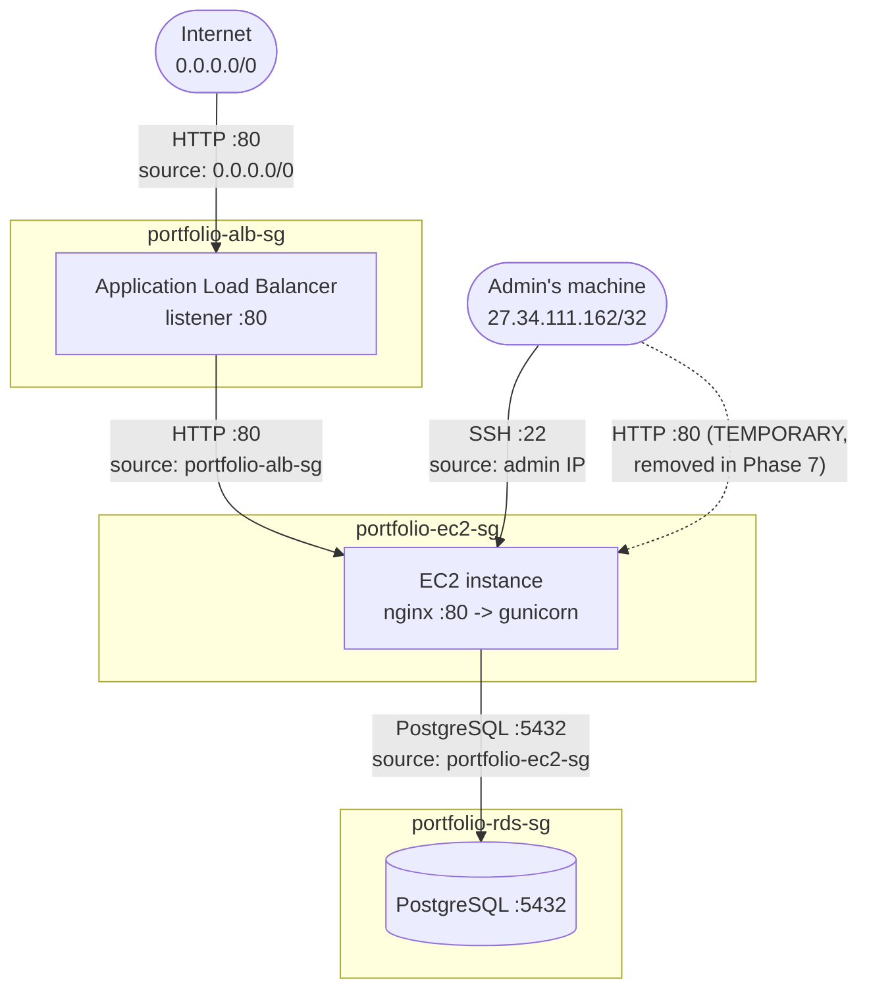

# Cloud Implementation Steps — Running Log

This is the build log for the AWS deployment described in [`cloud_architecture.md`](cloud_architecture.md). It's appended to after every step: what was done, what was created, what broke and how it got fixed. Treat `cloud_architecture.md` as "why it looks like this" and this file as "what actually happened, in order."

## How we're working together

- One phase at a time. Claude gives exact click-by-click / command-by-command instructions for the current phase only, plus the reasoning behind non-obvious choices.
- Claude asks before making any judgment call that isn't already pinned down in `cloud_architecture.md`'s decisions table, rather than assuming.
- After a Console step, report back concretely — resource name, region, any ID/ARN shown — so the log below stays accurate.
- Paste full error text/stack traces, not paraphrases, when something breaks.
- Claude proactively flags the teardown checklist at natural session-end points, since billable resources (EC2, RDS, ALB) get torn down after every session per `cloud_architecture.md`.
- Say the word if you want more/less explanation depth at any point — default is to explain the "why," not just hand over commands.

## Phase status

| # | Phase | Status |
|---|---|---|
| 0 | Guardrails (MFA, IAM admin user, budget alarm) | Done |
| 1 | Security groups | Done |
| 2 | S3 bucket | Done |
| 3 | ECR repo + first image push | Done |
| 4 | RDS Postgres | Done |
| 5 | EC2 instance + bootstrap | Done |
| 6 | Django code changes (S3, prod compose) | Done |
| 7 | ALB + target group | Done |
| 8 | End-to-end verification | Done |
| 9 | CI/CD (GitHub Actions → ECR → EC2) | Not started |
| 10 | Terraform | Not started |

## Log

*(Entries are appended below as each step happens — newest at the bottom.)*

### Phase 0 — Guardrails — Done
- Root user MFA enabled.
- IAM admin user created: `Rishav2` (attached `AdministratorAccess`), access key generated and configured locally via `aws configure` — confirmed working (`aws sts get-caller-identity` returns `arn:aws:iam::897021975353:user/Rishav2`).
- Budget/billing alarm set up.
- Region in use: originally us-east-2, then switched — see Phase 1 update below. AWS CLI v2.35.21 confirmed installed and working on the local machine.
- Decided: for later phases, CLI-recommended steps will be run by the user themselves in their own terminal (not executed on their behalf), consistent with the "Console for learning" choice — Claude provides exact commands, user pastes and runs them.

### Phase 1 — Security groups — Done
- Local public IP for SSH/temporary HTTP access: `27.34.111.162` (auto-detected via `curl https://checkip.amazonaws.com`).
- Console recommended for creating the 3 security groups (source-group dropdowns are friendlier than tracking group IDs by hand in CLI); CLI reference commands also provided for comparison per user's request to see both approaches for each step.
- **Switched IAM identity and region**: local AWS CLI reconfigured to a new IAM user `admin2` (same account `897021975353`), confirmed via `aws sts get-caller-identity` → `arn:aws:iam::897021975353:user/admin2`, confirmed `AdministratorAccess` attached via `aws iam list-attached-user-policies`. Region switched from us-east-2 to **us-east-1** (`aws configure get region` → `us-east-1`).
- Default VPC for **us-east-1**: `vpc-034873853e9305e1b` (CIDR `172.31.0.0/16`) — supersedes the earlier us-east-2 VPC ID (`vpc-0251acd12d071803c`, no longer used). This is what the security groups below, and later EC2/RDS, will use.

**Concepts — what SGs are and why this shape:**
- An SG is a stateful, default-deny virtual firewall attached to a resource (not a subnet). Stateful = allowing an inbound connection auto-allows its response traffic out, so outbound stays "allow all" for all three groups without weakening security — restricting egress (allowlisting every external endpoint a server calls) is a real hardening step but high-maintenance, skipped here.
- Three SGs form a chain of trust, each layer trusting only the one directly in front of it: `Internet → portfolio-alb-sg (0.0.0.0/0:80) → portfolio-ec2-sg (:80 from alb-sg only) → portfolio-rds-sg (:5432 from ec2-sg only)`. RDS is unreachable from the internet or even directly from the admin — only the app server can reach it. This is defense in depth: compromising one layer doesn't hand over the next.
- Rules that source *another security group* (not a CIDR) mean "from any resource wearing that SG" — stays correct automatically if an instance is replaced/IP changes, unlike a hardcoded IP rule.
- SSH (22) is restricted to the admin's own IP (`27.34.111.162/32`) — port 22 is constantly scanned by bots; this is one of the highest-value AWS security habits.
- `portfolio-ec2-sg` has one **temporary** rule: port 80 open to the admin's IP directly, needed only so Phase 5 can verify the app on the instance's own public IP before the ALB exists. Removed in Phase 7 once the ALB is live and tested — after that, the ALB is the only legitimate path in.
- Confirmed with user: staying on the **default VPC** (`vpc-034873853e9305e1b`), not building a custom VPC. Custom VPC w/ private subnets + NAT Gateway remains the documented "real production" upgrade in `cloud_architecture.md`, skipped here — SGs already provide the access control, and a NAT Gateway would add ~$32/mo even idle, against the cost-minimum goal.
- **Industry-practice note (researched, verified July 2026):** real production environments essentially never use the default VPC — it's routinely called out (including in security benchmarks like CIS AWS Foundations, which flags "default VPC exists" as a finding) as unsuitable beyond prototyping, precisely because it's all-public-subnet with no segmentation. Standard production pattern is a custom VPC with public + private subnets across multiple AZs, provisioned via Terraform/CloudFormation/CDK rather than console click-ops. Default VPC is genuinely normal for learning/prototypes/personal projects, which is this project's category.
**Traffic flow diagram (Phase 1 security groups):**

Solid arrows are permanent rules; the dashed arrow is the temporary direct-IP rule removed once the ALB is verified working in Phase 7. Each subgraph boundary is one security group — an arrow crossing into it corresponds to one inbound rule on that group.

- **Decided (locked in):** manual build (Phases 0-9) uses the default VPC as planned. **Phase 10 (Terraform) will build a proper custom VPC** — public + private subnets across multiple AZs, RDS (and possibly EC2) moved into private subnets, NAT Gateway included — as the "do it properly, as code" version of this same infrastructure. Updated in `cloud_architecture.md`'s decisions table and out-of-scope list accordingly.
- Heads up (new in 2026, unrelated to this decision but cost-relevant): AWS introduced "VPC Encryption Controls" pricing from March 1, 2026 — $0.15/hr per non-empty VPC if its opt-in monitor/enforce mode is turned on. Not enabled by default; just worth not accidentally toggling on for either the default or a future custom VPC.

**Created and verified (via `aws ec2 describe-security-groups`):**

| Group | ID | Inbound rules confirmed |
|---|---|---|
| `portfolio-alb-sg` | `sg-0e6d18795f066b156` | 80/tcp from `0.0.0.0/0` |
| `portfolio-ec2-sg` | `sg-06f3a66045a41493b` | 80/tcp from `sg-0e6d18795f066b156` (alb-sg); 80/tcp from `27.34.111.162/32` (temp, tagged "remove in Phase 7"); 22/tcp from `27.34.111.162/32` |
| `portfoli-rds-sg` *(named without the "o" — typo at creation, cosmetic only, SG names are immutable so left as-is)* | `sg-0f3a9603f0d744ab1` | 5432/tcp from `sg-06f3a66045a41493b` (ec2-sg) |

All three in `vpc-034873853e9305e1b` (us-east-1 default VPC). Matches the planned chain of trust exactly.

### Phase 2 — S3 bucket — Done

- Bucket type: **General purpose** (not "Directory" — that's the newer S3 Express One Zone type for low-latency/high-throughput niche workloads, single-AZ, not built for public-bucket-policy access patterns or `django-storages` — wrong fit for media storage).
- Bucket name: `portfolio-media-897021975353` (account ID as the uniqueness suffix), region **us-east-1**.
- CLI note: `aws s3 mb s3://<bucket> --region us-east-1` is the simpler high-level equivalent for bucket creation itself; `put-public-access-block` and `put-bucket-policy` only exist as `aws s3api` low-level calls (no high-level shorthand), so those two stay `s3api` either way.

**Concepts — Block Public Access, and why the bucket policy is safe:**
- Block Public Access is a blanket override added by AWS in 2018 after repeated public-bucket data breaches — it wins over any policy/ACL, forcing "public" to be a deliberate choice. It's 2 mechanisms (ACLs, bucket policies) × 2 scopes (new grants, any grant) = 4 checkboxes.
- **ACL-blocking stays ON** (both checkboxes): ACLs are the legacy per-object permission mechanism, hard to audit (permissions scattered per-object rather than in one document); we're using Object Ownership "Bucket owner enforced," which disables ACLs entirely anyway, so blocking them costs nothing.
- **Bucket-policy-blocking turned OFF** (both checkboxes): we're deliberately using a bucket policy — one auditable JSON document — to grant scoped public read. Leaving these blocked would make our policy silently ineffective (still 403 on every request).
- The bucket policy grants **`s3:GetObject` only**, to `Principal: "*"`, scoped to `arn:...:bucket-name/*`. Deliberately excludes `ListBucket` (can't browse/enumerate contents), `PutObject` (can't upload), `DeleteObject` (can't delete) — public here means "viewable by direct link, nothing more." This scoping is why it's safe for content that's already meant to be publicly visible on the portfolio site (project images, CV) — would be the wrong call for any bucket holding non-public data.
- Versioning left disabled (no rollback need for this content, avoids extra storage/lifecycle-rule complexity); default encryption left at SSE-S3 (free, protects data at rest, orthogonal to the public-read policy which governs application-layer access).

**Created and verified (via `aws s3api get-public-access-block` / `get-bucket-policy` / `get-bucket-location`):**
- Bucket `portfolio-media-897021975353` exists in us-east-1 (`LocationConstraint: null` is the expected/normal representation for us-east-1 specifically, not an error).
- Public access block: `BlockPublicAcls=true, IgnorePublicAcls=true, BlockPublicPolicy=false, RestrictPublicBuckets=false` — matches plan exactly.
- Bucket policy: public `GetObject` only, scoped to `arn:aws:s3:::portfolio-media-897021975353/*` — matches plan exactly.

Phase 2 done. Status: Done.

### Phase 3 — ECR repo + first image push — Done

- Repo created: `portfolio-web`, private, us-east-1, mutable tags, scan-on-push off, AES256 encryption (all defaults, matches plan). ARN: `arn:aws:ecr:us-east-1:897021975353:repository/portfolio-web`.
- **Error hit — typo, not a real bug:** first attempt ran `docker ecr get-login-password ...` (should be `aws ecr`) — `docker` has no `ecr` subcommand, produced "unknown flag: --region" against docker's own usage. Fixed by using `aws ecr get-login-password`.
- **Error hit — PowerShell native-pipe corruption of the ECR auth token:** `aws ecr get-login-password --region us-east-1 | docker login --username AWS --password-stdin ...` failed with `400 Bad Request` when run in Windows PowerShell 5.1. Root cause: PowerShell reprocesses a native command's stdout as .NET string objects before feeding the next native command's stdin (rather than a raw byte passthrough like a POSIX shell), which corrupts a single-line auth token. Confirmed by running the identical command via Bash — succeeded immediately (`Login Succeeded`) — isolating the issue to PowerShell's pipeline specifically, not AWS credentials/permissions/region. **Fix used:** routed the pipe through `cmd /c "..."` from within PowerShell (raw byte piping, no .NET reprocessing) — succeeded. Alternative fix (not needed here but noted): run the same command directly in Git Bash instead. `docker login` credentials land in `~/.docker/config.json`, shared across all shells on the machine, so subsequent commands could go back to plain PowerShell.
- **General note for future phases:** avoid piping between two native/external programs directly in PowerShell 5.1 when one side needs an exact byte-for-byte token/credential — wrap in `cmd /c "..."` or use Git Bash for that specific command. Single commands (no pipe) are unaffected — `docker build`/`tag`/`push` all ran fine in plain PowerShell.
- Also confirmed (in this session, using Claude's own Bash tool as an independent check): AWS CLI already authenticated with `ecr:GetAuthorizationToken` permission (via `admin2`'s `AdministratorAccess`), so no IAM changes were needed for this phase.
- **Image built and pushed:** `docker build -t portfolio-web:latest .` (from `portfolio/`, context matches the existing `docker-compose.yml`'s `context: portfolio`) → tagged `897021975353.dkr.ecr.us-east-1.amazonaws.com/portfolio-web:latest` → pushed. Verified via `aws ecr describe-images`: `:latest` tag present, ~162MB image layer, pushed successfully. A couple of untagged manifests from an earlier attempt are sitting in the repo too — harmless, well within ECR's free-tier storage allowance, not cleaned up given the practice/teardown nature of this project.
- Pipeline proven end-to-end: local Docker Desktop → ECR, ready for Phase 5 (EC2 will pull this same image via its IAM role).

### Phase 4 — RDS Postgres — Done

- Console's "Free tier" template has apparently been renamed/restructured — options now shown are **Production / Dev-Test / Sandbox**. Went with **Sandbox** (the likely renamed equivalent), then manually verified/overrode the fields that matter rather than trusting the template blindly, since Standard create allows full control regardless of template.
- Engine: **PostgreSQL** (not Aurora) — Aurora is a separate proprietary engine under the RDS umbrella, not covered by the same free tier, overkill for this workload.
- Creation method: **Standard create** (full configuration), not Easy create (limits control over Public access/SG/initial DB name) and not "Restore from S3" (that's for importing an existing backup, not creating a new empty DB).
- Instance class: **`db.t4g.micro`** selected by the Sandbox template (Graviton/ARM) instead of `db.t3.micro` — kept it. Still free-tier eligible (RDS free tier explicitly covers t2/t3/t4g micro, Single-AZ), and CPU architecture is a non-issue for RDS specifically since the app only ever talks to it over the Postgres wire protocol — unlike EC2, there's no Docker image architecture-matching concern.
- **Declined the "connect to an EC2 compute resource" option** — no EC2 instance exists yet (Phase 5 comes next), and more importantly this SG relationship was already deliberately hand-built in Phase 1 (`portfoli-rds-sg` allows 5432 only from `portfolio-ec2-sg`); letting the wizard auto-manage it risked a redundant/parallel rule instead of using the one already designed, and would have bypassed the point of building it by hand.
- Backup/Maintenance section:
  - **Automated backup: turned ON** (overriding Sandbox's off-by-default) — free while the instance exists (backup storage up to 100% of DB size included), automated backups (unlike manual snapshots) are deleted automatically when the instance is deleted, so this doesn't conflict with the teardown-every-session plan or its cost goal at all. Gives same-session point-in-time recovery if something goes wrong while experimenting.
  - Copy tags to automated backup: left unchecked (irrelevant for a single untagged-at-scale personal project).
  - Auto minor version upgrade: left **checked** (AWS default) — low-risk, applies security patches automatically.
  - Maintenance window: left "No preference" — only matters for systems with real traffic patterns to avoid.
  - Deletion protection: left **unchecked**, as planned — keeps session-end teardown friction-free; the documented tradeoff vs. real production (which would enable this).

**Created and verified (via `aws rds describe-db-instances`):**

| Field | Value | vs. plan |
|---|---|---|
| Status | `backing-up` at check time (normal transient state right after creation — RDS takes an initial backup as part of provisioning; settles to `available` shortly) | — |
| Instance class | `db.t4g.micro` | as decided above |
| Engine / version | `postgres` / **18.3** | **deviation** — planned 16.x to match local `postgres:16-alpine`; came up as 18.3 (likely dropdown default, not explicitly picked). **Decided: keep 18.3** — no real compatibility risk for this app (Django/psycopg2 are version-tolerant, no Postgres-16-specific SQL in use), not worth the ~10-15 min delete+recreate. |
| Multi-AZ | `false` | matches plan |
| Publicly accessible | `false` | matches plan — the important one |
| Security groups | only `sg-0f3a9603f0d744ab1` (`portfoli-rds-sg`) | matches plan — no stray "default" SG attached |
| Database name | **`portfoliodb`** (no underscore) | **deviation** — Django's `settings.py` defaults `DB_NAME` to `portfolio_db` (with underscore). Not recreating over this — Phase 6 will just set `DB_NAME=portfoliodb` in `.env` to match the real value rather than the code's default. |
| Backup retention | 1 day | automated backup on, as decided (shorter retention than the assumed 7-day default, still fine — free, and this DB doesn't live long enough for retention length to matter) |
| Deletion protection | `false` | matches plan |
| Storage | 20 GiB | matches plan |
| **Endpoint (needed for Phase 6)** | `portfolio-db.cifqyg8o0qxf.us-east-1.rds.amazonaws.com:5432` | — |

Phase 4 done.

### Phase 5 — EC2 instance + bootstrap — Done

**5a — IAM role `portfolio-ec2-role` created:**
- Trust policy: AWS service = EC2 (only EC2 instances can assume this role).
- Attached AWS managed policy `AmazonEC2ContainerRegistryReadOnly` (ECR pull access — account-wide, not scoped to just `portfolio-web`, a known simplification vs. true least-privilege).
- Added inline policy `portfolio-s3-media-access`: `GetObject`/`PutObject`/`DeleteObject` scoped to `arn:aws:s3:::portfolio-media-897021975353/*`, plus `ListBucket` scoped to the bucket itself (no `/*` — bucket-level action, different ARN shape than the object-level ones).

**Concepts — role vs. policy, and why ECR/S3 use different policy types:**
- A policy is a rulebook (JSON: what's allowed on what resource); a role is an identity that can "wear" policies but does nothing on its own. A role actually carries two distinct policy types: the **trust policy** (who can assume the role — here, EC2) and **permission policies** (what it can do once assumed — the ECR + S3 grants).
- EC2 can't attach a role directly — needs an **instance profile** wrapper (historical API leftover). Console creates this invisibly when "EC2" is picked as the use case; CLI needs explicit `create-instance-profile` + `add-role-to-instance-profile` calls.
- ECR uses an **AWS managed policy** (pre-written/maintained by AWS, reusable, but generic — grants access to any repo in the account, not just `portfolio-web`). S3 uses a **hand-written inline policy** because it has to name our specific bucket, which no generic AWS-authored policy could predict. Using a broad managed S3 policy instead (e.g. `AmazonS3ReadOnlyAccess`) would've granted access to every bucket in the account — breaks the least-privilege principle followed everywhere else in this build (SG chain, bucket policy's `GetObject`-only scoping). Noted as a "could go further" item: `AmazonEC2ContainerRegistryReadOnly` could itself be replaced with a custom policy scoped to just `portfolio-web` for true least-privilege — skipped here as a reasonable beginner-friendly simplification on a single-repo account.

**5b — EC2 instance launched, chose Ubuntu over Amazon Linux 2023 per user preference/familiarity.** Verified via `aws ec2 describe-instances` / `describe-volumes` / `describe-images`:

| Field | Value | Note |
|---|---|---|
| Instance ID | `i-09507eb922f06e363` | Name tag was initially missing at launch (cosmetic) — fixed via `aws ec2 create-tags`, now tagged `Name=portfolio-web-server`, confirmed via `describe-instances` |
| State | `running` | |
| Type | `t3.micro` | x86_64 — deliberately not `t4g` (ARM), since the ECR image was built on Windows Docker Desktop as amd64; a Graviton instance would fail with `exec format error` |
| AMI | Ubuntu **26.04 LTS "resolute"** (`ami-0b6d9d3d33ba97d99`, Canonical-owned) | deviation — planned 24.04, Console's quick-pick defaulted to the newest LTS available (26.04, released after my last update). Low-stakes: still Ubuntu/apt, no local-dev Ubuntu version being matched against (unlike the RDS Postgres version) |
| Public IP | `3.80.139.1` | needed for SSH + direct testing before the ALB exists |
| Private IP | `172.31.23.220` | within default VPC CIDR |
| Security groups | only `portfolio-ec2-sg` (`sg-06f3a66045a41493b`) | matches plan, no stray default SG |
| IAM instance profile | `arn:aws:iam::897021975353:instance-profile/portfolio-ec2-role` | confirmed attached |
| Key pair | `portfolio-ec2-key` | |
| Root volume | 20 GiB, gp3 | matches plan |

Also noted in passing: the account has one pre-existing, unrelated instance (`telco-data-platform-dev-ssm-utility`, `t4g.nano`) from some other project — not touched, not part of this build, just visible in the account-wide instance listing.

**5c — connecting: user is using MobaXterm (not native Windows OpenSSH) to SSH in.** MobaXterm is generally more lenient about Windows ACLs on private key files than native OpenSSH's Windows client, which strictly refuses "unprotected" keys — so the `.pem` file's NTFS permissions may not need fixing at all via MobaXterm. (If it ever does complain: fix is `icacls key.pem /reset`, `/grant:r "$env:USERNAME:(R)"`, `/inheritance:r` — rewrites the file's ACL to "only this account, read-only," equivalent to `chmod 400`. Moving the file to a different folder does **not** reliably achieve the same thing — a same-drive move in Windows preserves the existing ACL rather than resetting it, so the fix has to be the ACL rewrite itself, not relocation.)

**Concepts — SSH connection mechanics (MobaXterm session config: host `3.80.139.1`, user `ubuntu`, port 22, private key `portfolio-ec2-key.pem`):**
- Two independent security layers are in play, not one: the security-group port-22-from-my-IP rule (Phase 1) controls whether the connection attempt is even allowed to reach the box network-wise; the private-key challenge-response controls whether, having reached it, the attempt is actually authenticated. Both have to pass.
- Username must match whatever the AMI's default user is (`ubuntu` for Ubuntu, `ec2-user` for Amazon Linux) — this is who the launch-time public key was actually installed for; using the wrong username fails auth even with a correct key.
- The "unknown host, trust it?" fingerprint prompt on first connect is a *separate* check from key-pair auth — it guards against connecting to an impostor server, not against being an impostor client. Gets cached after acceptance; will reappear fresh whenever this instance is torn down and relaunched (new instance = new host key), which is expected given the teardown-per-session workflow, not a red flag.
- No Elastic IP in this build — deliberate: an Elastic IP is free while attached to a running instance but bills hourly while unattached, exactly the trap the "terminate at session end" workflow would create. Consequence: the public IP is different every session, and both the MobaXterm session's "Remote host" field and the SSH host-key trust need updating/re-accepting each time.
- **`-i` flag / key pair deep dive:** `-i` = "identity file," tells `ssh` which private key to use (mandatory here — these AMIs have password login disabled entirely). The key pair is two mathematically linked halves, not one secret: the private half (the `.pem` file) never leaves the local machine and AWS never keeps a copy after the one-time download; the public half was written by `cloud-init` into `/home/ubuntu/.ssh/authorized_keys` on the instance at boot. During the handshake, the server issues a challenge that only the private key can correctly sign, and the client proves possession without ever transmitting the private key itself over the network — fundamentally different from password auth, where a real secret has to travel. Practical consequence: losing the `.pem` file means permanently losing SSH access to that instance (no AWS-side recovery), short of the involved EBS-volume-mount recovery route.
- How username-per-AMI-family and public IP lookup work (self-service, not something to keep asking about): SSH username is fixed per AMI publisher (`ubuntu` for Ubuntu, `ec2-user` for Amazon Linux, etc. — not looked up, just a known convention), while the public IP does need a fresh lookup every session (Console instance Details tab, the instance's "Connect" button which also supplies a ready-to-use SSH command, or `aws ec2 describe-instances --query Reservations[0].Instances[0].PublicIpAddress`).

**Error hit — SSH connection timeout after a short break.** Root cause: user's local public IP changed (ISP-assigned dynamic IP, likely from a connection drop/reconnect during the break) from `27.34.111.162` to `27.34.111.154` — `portfolio-ec2-sg` still only allowed the old IP, so the SG correctly blocked the new one (timeout, not a rejection, is the expected symptom of an SG-level block — the packet is silently dropped rather than actively refused). Diagnosed via CLI: confirmed instance was still `running` at the same public IP (`3.80.139.1`, unchanged since it was never stopped, only the SSH client's source IP had moved), confirmed current local IP via `curl https://checkip.amazonaws.com`, compared against the SG's actual allowed CIDR via `describe-security-groups`. **Fix:** updated both the SSH (22) and temporary HTTP (80) rules on `portfolio-ec2-sg` from `27.34.111.162/32` to `27.34.111.154/32` via `revoke-security-group-ingress` + `authorize-security-group-ingress`. **Takeaway for future sessions:** any time SSH suddenly times out after a gap, check current public IP (`curl https://checkip.amazonaws.com` or visit it in a browser) against the SG's allowed source before assuming anything's wrong with the instance itself — this will very likely recur on later reconnects too, given home/mobile ISPs reassign IPs periodically.

**Deployment files prepared:**
- `portfolio/docker-compose.prod.yml` created (by Claude, directly in the repo) — **minimal first version: `web` + `nginx` only**, deliberately omitting Prometheus/Grafana for this initial deploy to keep the failure surface small given several real errors already hit this session; monitoring containers to be added back once the core path (Django ↔ RDS ↔ nginx) is confirmed working. `web` points at the ECR image URI (`897021975353.dkr.ecr.us-east-1.amazonaws.com/portfolio-web:latest`), no `build:` (prod always deploys a pre-built image). `db` service and `postgres_data` volume removed entirely — RDS replaces both, connected via `DB_HOST` in `.env`. `static_volume`/`media_volume` named volumes kept, shared read-write by `web` and read-only by `nginx` — necessary because containers don't share filesystems by default and are ephemeral (anything `collectstatic` writes inside the container alone would vanish on restart and be invisible to nginx). Only `nginx` publishes a host port (80) — `web`/gunicorn's port 8000 is only reachable container-to-container via Compose's internal DNS (service name = hostname, matching `nginx.conf`'s existing `proxy_pass http://django` → resolves `web:8000`).
- `portfolio/nginx/nginx.conf` reused as-is (copied via `scp`, no changes needed — already proxies to `web:8000` by service name, already serves static/media via volume aliases).
- Kept as a separate file from the existing `docker-compose.yml` (not edited in place) specifically so local dev (its own `db` container, Docker Hub image, full monitoring stack) stays unaffected — `-f docker-compose.prod.yml` vs. the default file selects which environment a given `docker compose` invocation describes.
- Generated a `SECRET_KEY` locally (Python `secrets.choice` over a 50-char alphabet) for the instance's `.env`.
- `.env` plan for this smoke test: `SECRET_KEY`, `DEBUG=False`, `ALLOWED_HOSTS=3.80.139.1` (EC2 public IP only for now — ALB DNS name added in Phase 7), `DB_NAME=portfoliodb`, `DB_USER`/`DB_PASSWORD` (RDS master credentials — user fills in themselves, password never shared with Claude), `DB_HOST=portfolio-db.cifqyg8o0qxf.us-east-1.rds.amazonaws.com`, `DB_PORT=5432`. Email/social-link vars deliberately omitted — default to blank/console-backend per `settings.py`, not needed until Phase 8's full verification pass.

**Errors hit getting the stack up, in order, with fixes:**

1. **`scp` IP typo**: used `3.80.129.1` instead of the real `3.80.139.1` (digits transposed) → plain connection timeout to an unrelated address, no SG involvement. Fix: retype/copy-paste the correct IP.

2. **`scp` "Could not resolve hostname e"`**: ran `scp -i portfolio-ec2-key.pem "e:/portfolio_site/..." ...` from **MobaXterm's local terminal** (Unix/Cygwin-style, prompt `/home/rupak/Desktop`) — `scp` parsed `e:` as a *hostname* (its own `host:path` syntax is structurally ambiguous with a bare Windows drive letter + colon), tried to resolve a host literally named `e`, failed. Fix: use MobaXterm's drive-mount path instead (`/drives/e/portfolio_site/...`), or run the same command from a plain Windows PowerShell window instead (native path handling, no `host:path` ambiguity there).

3. **`docker compose up` warnings: "The 'Jlq' variable is not set"**: the generated `SECRET_KEY` contained a literal `$Jlq` substring. Compose auto-loads any `.env` file in the project directory to interpolate `${VAR}` patterns in the compose YAML itself, and treats any `$word` it finds in that file as an attempted variable reference — found `Jlq`, no such variable exists, warned and substituted blank (harmless in our case since `docker-compose.prod.yml` has no `${...}` references that would actually consume it, but confusing/risky enough not to leave in place). Fix: regenerated `SECRET_KEY` from a `$`-free character set instead of chasing the interpolation semantics.

4. **ECR pull: `pull access denied ... no basic auth credentials`**: Docker had no stored login for the ECR registry under the *current* user context when `docker compose up` ran. Root cause: `docker login` was very likely run as root (or before the `usermod -aG docker` + reconnect step took effect), landing credentials in `/root/.docker/config.json` — but `docker compose up` running as plain `ubuntu` (no `sudo`) looks in `/home/ubuntu/.docker/config.json`, which didn't have the entry. Fix: re-ran `aws ecr get-login-password | docker login ...` as the current `ubuntu`-user shell (no `sudo`), confirmed `Login Succeeded`, retried — pull worked.

5. **RDS connection: `password authentication failed for user "portfolio_admin"`, plus a secondary `no pg_hba.conf entry ... no encryption` message.** Diagnosed by testing a direct `psql -h <endpoint> -U portfolio_admin -d portfoliodb` connection (typed password interactively, bypassing `.env`/Compose parsing entirely) to isolate whether the password itself was wrong vs. a `.env`-escaping issue like #3 above. **Turned out the user had simply forgotten the RDS master password** (confirmed: AWS never stores/displays it after creation, same as an EC2 key pair — no recovery possible, only reset). Fix: **RDS Console → `portfolio-db` → Modify → set new master password → "Apply immediately"** (important — otherwise it can defer to the next maintenance window), generated a fresh alphanumeric-only password (`H3GMRT16gpuA3n62U2b8HLza`, deliberately no special characters this time given #3) to sidestep any repeat of the escaping issue, updated `DB_PASSWORD` in `.env`, retested via `psql` (succeeded), then `docker compose up` again.

Also clarified along the way: the RDS **endpoint** (`portfolio-db.cifqyg8o0qxf.us-east-1.rds.amazonaws.com`) is a DNS hostname resolving to the instance's private IP — used for actual network connections (`DB_HOST`, `psql -h`) — completely different from an **ARN** (`arn:aws:rds:us-east-1:897021975353:db:portfolio-db`), which is AWS's internal identifier used in IAM policies etc., never used for connecting.

**Result: stack came up successfully.** `web` logs confirm: all migrations applied cleanly against RDS (`admin`, `auth`, `contenttypes`, `portfolio_pages`, `sessions`), 140 static files collected, Gunicorn started (3 workers) listening on `:8000`. `nginx` container also running.

**Verified: `http://3.80.139.1` loads the portfolio homepage successfully in a browser.** This is the actual point of Phase 5's smoke test — full path confirmed working: Internet → ALB-SG-less direct IP (temp rule) → `portfolio-ec2-sg` → nginx → gunicorn → Django → RDS. Phase 5 done.

**Concepts — why each launch setting was chosen:** AMI = base OS (Ubuntu per user's comfort, LTS for 5yr patches). Instance type = architecture match with the already-built image + free-tier burstable fit for low, spiky traffic. Key pair = asymmetric SSH auth (second half of the SSH story alongside the SG rule from Phase 1 — SG gates *who can attempt* a connection, the key gates *whether it authenticates*). Public IP = required for SSH now and direct-IP testing before the ALB exists in Phase 7. Security group = the actual enforcement layer built in Phase 1, deliberately without AWS's broader "default" SG layered on. 20GB storage = headroom for Docker's layered images, still free-tier. IAM instance profile = what actually activates the Phase 5a role for this specific box, enabling ECR pull + S3 access with zero credentials on disk. Termination protection off = same session-teardown-friction tradeoff already logged for RDS's deletion protection.
### Phase 6 — Django code changes for S3 + prod compose — Done

**`requirements.txt`** — added `boto3==1.43.58`, `django-storages==1.14.6` (exact current versions checked live via PyPI's JSON API, not guessed). Converted file from UTF-16 to UTF-8 while editing (per `CLAUDE.md`'s known rough edge) — safer than continuing to hand-edit UTF-16 given the `$`-escaping surprise already hit with `SECRET_KEY`.

**`portfolio/portfolio/settings.py`** — three additions:
- `CSRF_TRUSTED_ORIGINS` (didn't exist before) — env-driven like `ALLOWED_HOSTS`, defaults empty/no-op now, will get the ALB DNS name in Phase 7.
- `SECURE_PROXY_SSL_HEADER = ('HTTP_X_FORWARDED_PROTO', 'https')` — lets Django trust nginx's already-present `X-Forwarded-Proto` header for HTTPS detection. Safe to add now precisely because nginx (not any external client) controls that header, and it's inert until `SECURE_SSL_REDIRECT`/`*_COOKIE_SECURE` are turned on later.
- S3 storage block: `AWS_STORAGE_BUCKET_NAME`/`AWS_S3_REGION_NAME` (env-overridable, default to the real bucket/region), `AWS_DEFAULT_ACL = None` (bucket relies on a bucket *policy* for public read — Phase 2 kept ACL-blocking on, so leaving django-storages' default ACL-setting behavior in place would error/no-op on every upload), `AWS_QUERYSTRING_AUTH = False` (objects are public via policy already; skip presigned URLs so links don't silently expire after ~1hr), deliberately **no** `AWS_ACCESS_KEY_ID`/`SECRET` (boto3 resolves credentials from the EC2 instance's IAM role automatically — the actual payoff of Phase 5a), and a `STORAGES` dict (Django 4.2+ API, replaces the old single `DEFAULT_FILE_STORAGE` string) routing `default` (media) to `storages.backends.s3.S3Storage` while `staticfiles` stays on the normal local backend, matching the "static stays local" architecture decision.

**`portfolio/docker-compose.prod.yml`** — added `prometheus`/`grafana` services back (previously omitted from the minimal Phase 5 deploy), matched closely to the original `docker-compose.yml` definitions. `prometheus.yml` bind-mount path flattened to `./prometheus.yml` (matching the same flat-file convention as `nginx.conf` on the instance, vs. local dev's nested `monitoring/` folder). Ports 9090/3000 are still published in the compose file (needed for SSH-tunnel access to the host's own interface) despite not being internet-reachable — that's enforced entirely by the security group (already confirmed no rule exists for either port on `portfolio-ec2-sg`), not by omitting the port mapping.

**Error hit — `requirements.txt` rewrite silently landed as UTF-16 again, not UTF-8.** Claude's first edit used the `Write` tool with plain-text content, intending UTF-8 — but the resulting `docker build` failed at `pip install -r requirements.txt` with `Invalid requirement: 'a\x00s\x00g\x00i\x00r\x00e\x00f...'` (null byte between every character — the exact UTF-16LE signature). Confirmed via `xxd` that the file was genuinely UTF-16LE (no BOM) on disk despite the Write tool call, for reasons not fully clear (possibly this Windows environment's file-write path defaulting back to UTF-16 for this file, echoing the original UTF-16 file `CLAUDE.md` had already flagged as a known rough edge). **Fix:** rewrote the file via a Bash heredoc (`cat > file << 'EOF' ... EOF`) instead, verified with `file` (reports "ASCII text") and `xxd` (no null bytes) that it's genuinely plain UTF-8 this time. **Takeaway:** for this specific file, don't trust a single write — verify the actual on-disk bytes with `xxd`/`file` after editing it, given it's already misbehaved twice.

**Error hit — `prometheus.yml` bind mount, two layered issues in sequence:**
1. First: `failed to create shim task ... not a directory: Are you trying to mount a directory onto a file?` — `~/prometheus.yml` didn't exist on the EC2 instance yet (the `scp` for it hadn't landed before `docker compose up` ran), so Docker auto-created the missing bind-mount source as an empty **directory**, then failed trying to mount that directory onto `/etc/prometheus/prometheus.yml` (a file path inside the image). Fixed by removing the auto-created directory (`sudo rm -rf ~/prometheus.yml`) and actually `scp`-ing the real file up.
2. Second, after the file existed: container entered a `Restarting (2)` crash loop, logs showed `open /etc/prometheus/prometheus.yml: permission denied`. Root cause: the official `prom/prometheus` image runs as a non-root, unprivileged internal user, and bind-mounted files keep whatever permissions they have **on the host** — Docker doesn't remap ownership for bind mounts (unlike named volumes). Whatever permissions the file ended up with after the `rm`+`scp` cleanup weren't world-readable. Fixed with `chmod 644 ~/prometheus.yml`, then `docker compose restart prometheus` to skip waiting for the crash loop's growing backoff timer. Confirmed healthy via logs: TSDB started, config loaded, "Server is ready to receive web requests."

**Error hit — S3 upload initially didn't appear in the bucket at all (no error shown).** Root cause: `web` container was still running the **pre-Phase-6 image** — `docker compose up -d` alone doesn't re-pull an image if one is already cached locally under the same tag; the earlier `docker compose pull` step either didn't run or didn't get picked up. Diagnosed cleanly via `docker compose exec web pip show django-storages` (confirms whether the running container's actual code has the new dependency at all, independent of what's sitting in ECR). Fixed with an explicit `docker compose pull` + `docker compose up -d --force-recreate` (force-recreate guarantees the container is rebuilt from the freshly-pulled image rather than left alone because Compose sees no config diff).

**Phase 6 verified complete:** rebuilt image confirmed running (`django-storages` present), all 4 containers up, CV upload via the site's own form confirmed landing in `s3://portfolio-media-897021975353/cv/` via `aws s3 ls --recursive`. Full chain confirmed working end-to-end: `STORAGES["default"]` → `S3Storage` → boto3 `PutObject` → IAM role credentials (no static keys) → inline policy's `s3:PutObject` grant → object written without an ACL (relies on bucket policy for public read, per Phase 2).

### Phase 7 — ALB + target group — Done

**7a — Target group `portfolio-tg` created:** Target type Instances (vs. IP addresses/Lambda/ALB — we have one specific known EC2 instance, direct-by-ID registration is the simplest fit), HTTP/80 (describes the ALB-to-target leg specifically, conceptually separate from whatever the public listener will use — relevant once HTTPS exists later, when the ALB could terminate TLS on 443 publicly while still forwarding to targets on plain 80 internally), default VPC (must match wherever the target instance lives), health check path `/portfolio_pages/` (not `/`, since root redirects and ALB health checks expect a 200, not a 3xx), thresholds left at AWS defaults (healthy=5 consecutive passes, unhealthy=2 consecutive fails, timeout=5s, interval=30s — reasonable general-purpose tradeoff, no strong reason to tune for a low-traffic practice site). `portfolio-web-server` registered as the sole target on port 80 (matches nginx's listening port).

**Concept — why "0 healthy, 0 unhealthy" right after creation is expected, not a problem:** with the default 30s interval and 5-consecutive-pass healthy threshold, the earliest a fresh target can flip to "healthy" is ~5×30s = 2.5 minutes after registration — it hasn't had enough check cycles yet, not a sign of misconfiguration on its own.

**Concept — ALB / target group / EC2 relationship, why the indirection exists:** ALB (internet-facing, listeners+rules) → Target Group (named, health-checked pool, not itself internet-facing) → EC2 instance (actual pool member). The target group layer exists specifically so pool membership can change (instance terminated/relaunched, or an ASG scaling up/down) without ever touching the ALB's listener/rules — the ALB only ever references the group by name. This is the exact mechanism an ASG uses to add/remove capacity automatically, and what lets one ALB route different paths/hosts to different backend pools. Full request path for this build: Client → ALB (`portfolio-alb-sg`) → listener rule → `portfolio-tg` → healthy member (`portfolio-web-server`) → instance port 80 (`portfolio-ec2-sg`, rule "80 from `portfolio-alb-sg`" — set up in Phase 1, unused until now) → nginx → gunicorn:8000 → Django. Once the target shows healthy and this path is confirmed working, the temporary direct-IP rule on `portfolio-ec2-sg` (Phase 1/5) becomes safe to remove in 7c — the ALB becomes the only legitimate path in, as originally designed.

**7b — ALB `portfolio-alb` created and verified via `aws elbv2 describe-load-balancers`/`describe-listeners`:** State `provisioning` (normal, takes a couple minutes like RDS did), DNS name `portfolio-alb-1889062998.us-east-1.elb.amazonaws.com` (needed for `.env`'s `ALLOWED_HOSTS`/`CSRF_TRUSTED_ORIGINS` in 7c), scheme `internet-facing`, correct VPC, only `portfolio-alb-sg` attached (no stray default SG), spans 3 AZs (`us-east-1a/b/c` — more than the minimum 2 required, harmless, no cost difference). Listener confirmed: HTTP:80 → forwards to `portfolio-tg`'s ARN, matching plan exactly.

**Target health progression observed (via `aws elbv2 describe-target-health`), confirms the earlier "unused" explanation:** before the ALB existed, target state was `unused`/`Target.NotInUse` ("not configured to receive traffic from the load balancer") — checks hadn't started at all. Immediately after the ALB + listener were created, state changed to `initial`/`Elb.RegistrationInProgress` — checks now actively running, just haven't yet accumulated the 5 consecutive passes needed to flip to `healthy` (per the threshold math logged above). This is the real version of the "give it ~2.5 minutes" wait.

**Error hit — target flipped to `unhealthy`/`Target.ResponseCodeMismatch`, "Health checks failed with these codes: [400]".** Diagnosed via `web`'s gunicorn access log (`docker compose logs --tail=100 web`), which revealed **three different callers all getting 400 for the same underlying reason** (`ALLOWED_HOSTS` mismatch), each with a different rejected `Host` header:
1. `ELB-HealthChecker/2.0` hitting `/portfolio_pages/` — the ALB reaches targets over the private network, so its health check's Host header is the target's **private IP** (`172.31.23.220`), not in `ALLOWED_HOSTS` (which only had the public IP).
2. A real browser request to `/` (user testing the ALB DNS name directly) — Host header `portfolio-alb-1889062998.us-east-1.elb.amazonaws.com`, also not yet allowed (this was always going to be needed for 7c, just surfaced earlier via the health check failure).
3. `Prometheus/3.13.1` hitting `/metrics` — scrapes `web:8000` directly per `prometheus.yml`'s target, Host header `web`, also not allowed.

**Fix:** updated `.env`'s `ALLOWED_HOSTS` to include all values needed by all three real callers: `3.80.139.1,172.31.23.220,portfolio-alb-1889062998.us-east-1.elb.amazonaws.com,web`. Also added `CSRF_TRUSTED_ORIGINS=http://portfolio-alb-1889062998.us-east-1.elb.amazonaws.com` while in there (needed for POST forms through the ALB, part of the originally-planned 7c work, done here instead). Applied via `docker compose up -d --force-recreate web`. Confirmed via logs: health checks and Prometheus scrapes both returned 200 immediately after. Target state took a few minutes to flip from `unhealthy` to `healthy` afterward — expected lag, since the aggregate state needed 5 fresh consecutive passes (default threshold) to overwrite the prior failure streak, not a sign the fix hadn't worked.

**Confirmed via `aws elbv2 describe-target-health` / `describe-load-balancers`: target `healthy`, ALB `active`.**

**7c — final tightening and verification:** Confirmed `http://portfolio-alb-1889062998.us-east-1.elb.amazonaws.com` loads the site. Removed the temporary direct-IP HTTP rule from `portfolio-ec2-sg` (`revoke-security-group-ingress`, port 80, `27.34.111.154/32`). Re-verified via `describe-security-groups`: port 80 now allows **only** `sg-0e6d18795f066b156` (`portfolio-alb-sg`), no CIDR entries left; port 22 (SSH) untouched, still allows the admin's current IP. Target group re-confirmed `healthy` after the change. **The ALB is now the only path to the app — Phase 7 done.**

**Concept — RDS does NOT follow the ALB/target-group pattern, and why:** target groups exist for stateless, interchangeable backends where any healthy member can correctly answer any request (true for Django/gunicorn instances, not true for a database — a Postgres instance *is* the data, can't round-robin writes across independent instances without real replication). RDS's actual HA/scaling mechanisms are different in kind: **Multi-AZ** (not used here) fails over to a synchronously-replicated standby with the *same DNS endpoint* automatically re-pointing — HA, not load balancing, only one instance ever active. **Read replicas** scale reads specifically, but each gets its own distinct endpoint and the app must explicitly choose which endpoint to query — not transparent like an ALB. This build uses Single-AZ RDS (Phase 4, cost tradeoff vs. Multi-AZ) — genuinely one instance, one endpoint, no pool/failover at all. Parallel noted: the EC2 side also has no Auto Scaling Group (explicit plan choice), so `portfolio-tg` has exactly one member today too — same "built to scale, not currently scaled" shape on both tiers, via unrelated underlying mechanisms.

**Concept — two different Compose variable mechanisms sharing one `.env` file:** `web`'s `env_file: .env` passes the file's raw lines into the *container's* environment with no interpretation. Separately, Grafana's `environment:` block uses `${GRAFANA_PASSWORD:-admin}`/`${EMAIL}`/`${EMAIL_PASSWORD}` directly in the *YAML itself* — this is Compose's own project-level interpolation (the same mechanism that misread `$Jlq` out of `SECRET_KEY` earlier), substituted when Compose parses the file, before any container starts. Both happen to read the same physical `.env` in this project, which is convenient but is two genuinely separate mechanisms, not one unified system. `:-admin` is Compose's fallback syntax (default if `GRAFANA_PASSWORD` is unset) — low-stakes here since Grafana isn't internet-reachable regardless.

### Phase 8 — End-to-end verification — Done

Full checklist run against the live ALB DNS name (`http://portfolio-alb-1889062998.us-east-1.elb.amazonaws.com`):

- **Homepage** — loads correctly.
- **Login** — superuser account works.
- **Add/edit a project with an image** — separate `ImageField` from the CV tested in Phase 6, same `photos/` prefix, same S3 backend — confirmed working.
- **CV download** — public S3 URL serves correctly end-to-end via the live site's download link, not just confirmed present in the bucket.
- **Contact form** — **decided to leave on Django's console `EmailBackend`** (documented gap, not a bug) rather than wire up real Gmail SMTP now — form "succeeds" but the email only prints to `web`'s container logs. `EMAIL_HOST_USER`/`EMAIL_PASSWORD` remain blank in `.env`. Revisit later if real email delivery is wanted.
- **`/metrics`** — loads as raw Prometheus-format plain text when visited directly (not a dashboard — that's expected/correct; Prometheus the *service* is what turns this into something browsable, and it's a separate, non-public service).
- **Prometheus/Grafana via SSH tunnel** — set up and verified working, not just "container is running":
  - Tunnel: `ssh -i portfolio-ec2-key.pem -L 9090:localhost:9090 -L 3000:localhost:3000 ubuntu@3.80.139.1` — forwards local ports through the existing SSH connection to the instance's own `localhost`, since `portfolio-ec2-sg` deliberately blocks 9090/3000 from anywhere external (Phase 6 decision).
  - Prometheus (`http://localhost:9090` locally) — confirmed both scrape targets (`django`/`web:8000`, `prometheus`/`localhost:9090`) show **UP** under Status → Targets.
  - Grafana (`http://localhost:3000` locally) — confirmed login succeeds with `admin` / the `GRAFANA_PASSWORD` set in the **EC2 instance's** `.env` (not the unrelated local-dev `.env` on the Windows machine, which briefly caused confusion — the two files are completely independent).

**Full manual build (Phases 0-8) confirmed working end-to-end.** Next: Phase 9 (CI/CD — redirect `.github/workflows/deploy.yml` from Docker Hub to ECR, automate the EC2 redeploy), then Phase 10 (Terraform, including a proper custom VPC).

